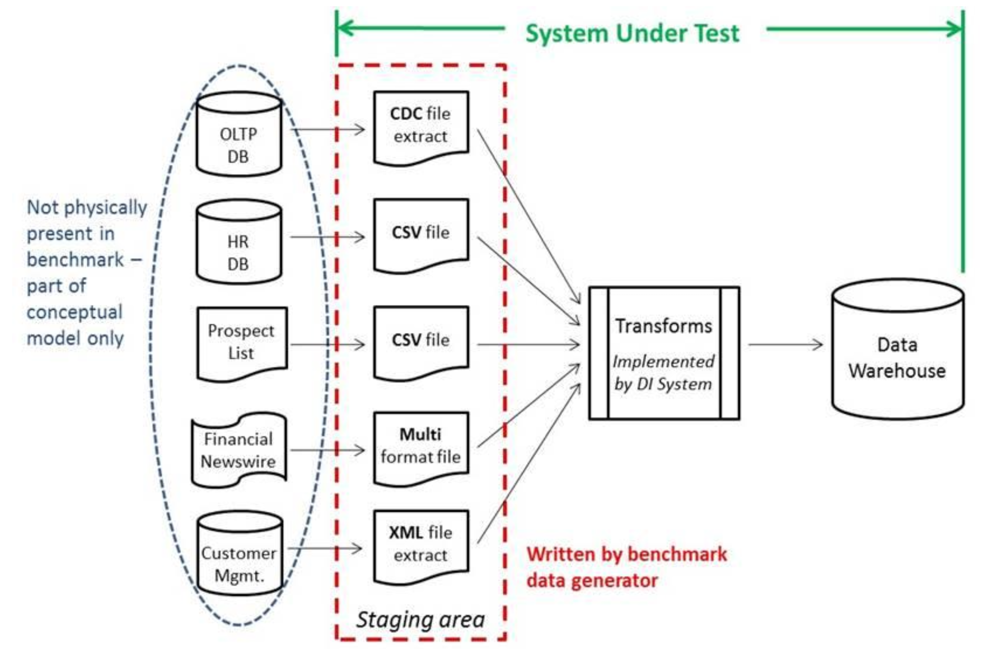
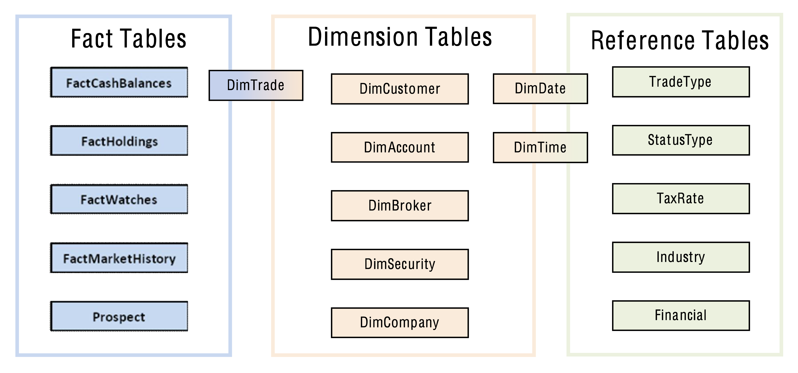

# What is this?
This project contains two distinct portions:
1. A CLI developed using [Python Snowpark](https://docs.snowflake.com/en/developer-guide/snowpark/python/index) and [Typer](https://typer.tiangolo.com/).
2. A dbt project for building the data warehouse defined in the [TPC-DI](https://www.tpc.org/tpcdi/) specification.




I should be clear in my goal here: I am not attempting to *actually run and measure* the TPC-DI benchmark.
The `tpcdi.py` CLI in this repository is single-threaded and ingests the data sequentially, which would be the worst approach if trying to optimize for a benchmark.
Instead, I needed a dataset that could be used to mimic data engineering workloads inside of Snowflake, so I just wanted the files loaded.





I took a few liberties with the TPC-DI specification to update it a bit for Snowflake. I replaced `CamelCase` names with `SNAKE_CASE`, mostly out of irritation with readability.
Secondly, I just couldn't stand for having the `DimTrade` table be "both a dimension table and a fact table, depending on how it is being used" as it was designed by TPC-DI.
That is clearly a decision made during an era when storage and compute were constrained, so in my design, I created both `DIM_TRADE` and `FACT_TRADE` tables.
Finally, I used a Medallion Lakehouse Architecture with Bronze, Silver, and Gold zones, with the logical model above materialized in the Gold zone.

# Using DIGen.jar to Generate Source Files
The Java program to generate the source files is downloaded by [filling out a form on the TPC-DI website](https://www.tpc.org/TPC_Documents_Current_Versions/download_programs/tools-download-request5.asp?bm_type=TPC-DI&bm_vers=1.1.0&mode=CURRENT-ONLY) and clicking a link in an email. Once unzipped, we have to make one slight change for running on macOS:

```bash
unzip 66a2b600-af36-4198-bfbc-c94c40cc22af-tpc-di-tool.zip && \
mv Tools/PDGF Tools/pdgf && \ #clearly written on a case-insensitive OS
cd Tools
```

I couldn't find any way to execute the provided JAR with a Java version newer than `1.8`. I spent some time trying to rebuild the JAR file using a newer Java version for posterity, but it was a fool's errand.
I installed [Azul Zulu Java 1.8](https://www.azul.com/downloads/?package=jdk#zulu) and used [jEnv](https://www.jenv.be/) to set a local version, and with that, we can see the help context from the JAR:

```
jenv add /Library/Java/JavaVirtualMachines/zulu-8.jdk/Contents/Home && \
jenv local 1.8 && \
java -jar DIGen.jar --help

usage: DIGen
 -h                   print this message
 -jvm <JVM options>   JVM options. E.g. -jvm "-Xms1g -Xmx2g"
 -o <directory>       Specify output directory.  Default is output.
 -sf <sf>             Scale factor.  Default value is 5. (range: 3 -
                      2147483647
 -v                   print DIGen version
 ```

This utility will generate a bunch of different data files in various formats with a scaling (or multiplication) factor determining how much data the files contain. 
It attempts to mimic ETL processes at the time the specification was written, which generally utilized file extracts from source systems. It generates CSVs and pipe-separated files (PSVs?), which are quite simple with Snowpark. 
The two file formats that proved the most fun and challenging were fixed-width fields and XML, as both required heavy DataFrame transformations. The files are generated in batches, with `Batch1` representing the historical load, and `Batch2` and `Batch3` representing various incremental loads. 
Currently, I've only tested the loader against `Batch1` and the dbt models have not yet been extended to handle additional batches. 
Also, I haven't yet implemented the Audit portion of the specification, which is somewhat embarrassing as a former co-founder of a data quality company.

```bash
java -jar DIGen.jar -o ~/dev/tpcdi-output -sf 10 && \
ls -lhtr ~/dev/tpcdi-output/Batch1

-rw-r--r--  1 stewartbryson  staff    52B Jul 21 14:30 StatusType_audit.csv
-rw-r--r--  1 stewartbryson  staff    89B Jul 21 14:30 StatusType.txt
-rw-r--r--  1 stewartbryson  staff    52B Jul 21 14:30 TaxRate_audit.csv
-rw-r--r--  1 stewartbryson  staff    17K Jul 21 14:30 TaxRate.txt
-rw-r--r--  1 stewartbryson  staff    52B Jul 21 14:30 Date_audit.csv
-rw-r--r--  1 stewartbryson  staff   3.3M Jul 21 14:30 Date.txt
-rw-r--r--  1 stewartbryson  staff    52B Jul 21 14:30 Time_audit.csv
-rw-r--r--  1 stewartbryson  staff   4.6M Jul 21 14:30 Time.txt
-rw-r--r--  1 stewartbryson  staff    12B Jul 21 14:30 BatchDate.txt
-rw-r--r--  1 stewartbryson  staff   3.9M Jul 21 14:30 HR.csv
-rw-r--r--  1 stewartbryson  staff    84B Jul 21 14:30 HR_audit.csv
-rw-r--r--  1 stewartbryson  staff   391B Jul 21 14:30 CustomerMgmt_audit.csv
-rw-r--r--  1 stewartbryson  staff    30M Jul 21 14:30 CustomerMgmt.xml
-rw-r--r--  1 stewartbryson  staff    10M Jul 21 14:30 Prospect.csv
-rw-r--r--  1 stewartbryson  staff   141B Jul 21 14:30 Prospect_audit.csv
-rw-r--r--  1 stewartbryson  staff    52B Jul 21 14:30 Industry_audit.csv
-rw-r--r--  1 stewartbryson  staff   2.6K Jul 21 14:30 Industry.txt
-rw-r--r--  1 stewartbryson  staff    81K Jul 21 14:30 FINWIRE1967Q1
-rw-r--r--  1 stewartbryson  staff   219B Jul 21 14:30 FINWIRE1967Q1_audit.csv
-rw-r--r--  1 stewartbryson  staff    77K Jul 21 14:30 FINWIRE1967Q2

{ Truncated }
```

# The Python Snowpark Loader: tpcdi.py
I used Conda to build my virtual environment, with all the steps to replicate in the snippet below:

```bash
conda env create -f environment.yml && \
conda activate tpcdi && \
python tpcdi.py --help
```


I created the loader using Typer for the CLI interface and Snowpark for uploading files, creating DataFrames from those files -- in some cases doing heavy transformations -- and saving them as tables. 
Credentials are provided using a credentials.json file in the root directory, and looks like this:

```json
{
    "account": "myaccount",
    "user": "myuser",
    "password": "mypassword",
    "role": "myrole",
    "warehouse": "stewart_dev",
    "database": "tpc_di",
    "schema": "digen"
}
```

Some improvements could be made to the credentials, schema, and database handling.
The utility writes the data to whatever database and schema is specified in the credentials, so those aspects of the connection are required.
Loading the files is accomplished with the process-files command and we can see the help context below:

```
❯ python tpcdi.py process-files --help
```


Let's start by loading a rather simple file - the `StatusType.txt`  which is pipe-delimited. 
I'll first demonstrate the `--show` option, which displays a sample of the DataFrame instead of loading it to a table. 
As you might have guessed, I added this option to aid in the development of the loader. 
Then I'll demonstrate loading the table:

```
❯ python tpcdi.py process-files --output-directory ~/dev/tpcdi-output \
--file-name StatusType.txt --show

File StatusType.txt: UPLOADED
-----------------------
|"ST_ID"  |"ST_NAME"  |
-----------------------
|ACTV     |Active     |
|CMPT     |Completed  |
|CNCL     |Canceled   |
|PNDG     |Pending    |
|SBMT     |Submitted  |
|INAC     |Inactive   |
-----------------------

❯ python tpcdi.py process-files --output-directory ~/dev/tpcdi-output \
--file-name StatusType.txt      

File StatusType.txt: SKIPPED
STATUS_TYPE table created.

❯ snowsql -c demo
* SnowSQL * v1.2.27
Type SQL statements or !help
stewartbryson#STEWART_DEV@TPC_DI.DIGEN>select * from STATUS_TYPE;
+-------+-----------+
| ST_ID | ST_NAME   |
|-------+-----------|
| ACTV  | Active    |
| CMPT  | Completed |
| CNCL  | Canceled  |
| PNDG  | Pending   |
| SBMT  | Submitted |
| INAC  | Inactive  |
+-------+-----------+
6 Row(s) produced. Time Elapsed: 0.752s
stewartbryson#STEWART_DEV@TPC_DI.DIGEN>
```

Notice that the second execution used Snowpark's `overwrite=False` feature of skipping already existing files during a put, which can be overridden with the `--overwrite` option.
For now, let's get the rest of the files loaded so we can move on to the dbt models. 
All DataFrames are saved in `overwrite` mode, so we can run it again without duplicating data:

```bash
❯ python tpcdi.py process-files --output-directory ~/dev/tpcdi-output  

File Date.txt: UPLOADED
DATE table created.
File DailyMarket.txt: UPLOADED
DAILY_MARKET table created.
File Industry.txt: UPLOADED
INDUSTRY table created.
File Prospect.csv: UPLOADED
PROSPECT table created.
File CustomerMgmt.xml: UPLOADED
CUSTOMER_MGMT table created.
File TaxRate.txt: UPLOADED
TAX_RATE table created.
File HR.csv: UPLOADED
HR table created.
File WatchHistory.txt: UPLOADED
WATCH_HISTORY table created.
File Trade.txt: UPLOADED
TRADE table created.
File TradeHistory.txt: UPLOADED
TRADE_HISTORY table created.
File StatusType.txt: SKIPPED
STATUS_TYPE table created.

{ Truncated }
```

# Building the Data Warehouse with dbt
I was having so much fun writing Snowpark Python that I considered writing the transformation pipelines in DataFrames as well.
But we wanted the dbt models because they represent so much of what the community is doing, and we wanted realistic workloads.
In the Medallion architecture, we typically append raw data in their original format into Bronze, business entities modeled in Silver, and our highly curated facts and dimensions in Gold. 
I'm loading with an x-small warehouse and 4 threads, with a `DIGen.jar` scaling factor of 10:

```bash
❯ dbt build
03:24:41  Running with dbt=1.5.2
03:24:41  Registered adapter: snowflake=1.5.2
03:24:41  Unable to do partial parsing because saved manifest not found. Starting full parse.
03:24:42  Found 45 models, 0 tests, 0 snapshots, 0 analyses, 436 macros, 0 operations, 0 seed files, 17 sources, 0 exposures, 0 metrics, 0 groups
03:24:42  
03:24:47  Concurrency: 4 threads (target='dev')
03:24:47  
03:24:47  1 of 45 START sql table model dl_bronze.brokerage_cash_transaction ............. [RUN]
03:24:47  2 of 45 START sql table model dl_bronze.brokerage_daily_market ................. [RUN]
03:24:47  3 of 45 START sql table model dl_bronze.brokerage_holding_history .............. [RUN]
03:24:47  4 of 45 START sql table model dl_bronze.brokerage_trade ........................ [RUN]
03:24:51  3 of 45 OK created sql table model dl_bronze.brokerage_holding_history ......... [SUCCESS 1 in 3.72s]
03:24:51  5 of 45 START sql table model dl_bronze.brokerage_trade_history ................ [RUN]
03:24:53  4 of 45 OK created sql table model dl_bronze.brokerage_trade ................... [SUCCESS 1 in 6.06s]
03:24:53  6 of 45 START sql table model dl_bronze.brokerage_watch_history ................ [RUN]
03:24:54  1 of 45 OK created sql table model dl_bronze.brokerage_cash_transaction ........ [SUCCESS 1 in 6.32s]
03:24:54  7 of 45 START sql table model dl_bronze.crm_customer_mgmt ...................... [RUN]
03:24:55  2 of 45 OK created sql table model dl_bronze.brokerage_daily_market ............ [SUCCESS 1 in 7.50s]
03:24:55  8 of 45 START sql table model dl_bronze.finwire_companies ...................... [RUN]
03:24:55  7 of 45 OK created sql table model dl_bronze.crm_customer_mgmt ................. [SUCCESS 1 in 1.54s]
03:24:55  9 of 45 START sql table model dl_bronze.finwire_financials ..................... [RUN]
03:24:56  8 of 45 OK created sql table model dl_bronze.finwire_companies ................. [SUCCESS 1 in 1.42s]
03:24:56  10 of 45 START sql table model dl_bronze.finwire_securities .................... [RUN]
03:24:57  5 of 45 OK created sql table model dl_bronze.brokerage_trade_history ........... [SUCCESS 1 in 6.35s]
03:24:57  11 of 45 START sql table model dl_bronze.hr_employee ........................... [RUN]
03:24:57  10 of 45 OK created sql table model dl_bronze.finwire_securities ............... [SUCCESS 1 in 1.25s]
03:24:57  12 of 45 START sql table model dl_bronze.reference_date ........................ [RUN]
03:24:58  9 of 45 OK created sql table model dl_bronze.finwire_financials ................ [SUCCESS 1 in 2.64s]
03:24:58  13 of 45 START sql table model dl_bronze.reference_industries .................. [RUN]
03:24:59  11 of 45 OK created sql table model dl_bronze.hr_employee ...................... [SUCCESS 1 in 1.54s]
03:24:59  14 of 45 START sql table model dl_bronze.reference_status_types ................ [RUN]
03:24:59  6 of 45 OK created sql table model dl_bronze.brokerage_watch_history ........... [SUCCESS 1 in 5.90s]
03:24:59  15 of 45 START sql table model dl_bronze.reference_tax_rate .................... [RUN]
03:25:00  13 of 45 OK created sql table model dl_bronze.reference_industries ............. [SUCCESS 1 in 2.06s]
03:25:00  16 of 45 START sql table model dl_bronze.reference_trade_types ................. [RUN]
03:25:01  12 of 45 OK created sql table model dl_bronze.reference_date ................... [SUCCESS 1 in 3.43s]
03:25:01  17 of 45 START sql table model dl_bronze.syndicated_prospects .................. [RUN]
03:25:03  17 of 45 OK created sql table model dl_bronze.syndicated_prospects ............. [SUCCESS 1 in 2.08s]
03:25:03  18 of 45 START sql table model dl_silver.daily_market .......................... [RUN]
03:25:03  14 of 45 OK created sql table model dl_bronze.reference_status_types ........... [SUCCESS 1 in 4.18s]
03:25:03  19 of 45 START sql table model dl_silver.employees ............................. [RUN]
03:25:03  15 of 45 OK created sql table model dl_bronze.reference_tax_rate ............... [SUCCESS 1 in 4.15s]
03:25:03  20 of 45 START sql table model dl_silver.date .................................. [RUN]
03:25:04  19 of 45 OK created sql table model dl_silver.employees ........................ [SUCCESS 1 in 1.21s]
03:25:04  21 of 45 START sql table model dl_silver.companies ............................. [RUN]
03:25:05  20 of 45 OK created sql table model dl_silver.date ............................. [SUCCESS 1 in 2.03s]
03:25:05  22 of 45 START sql table model dl_silver.accounts .............................. [RUN]
03:25:06  21 of 45 OK created sql table model dl_silver.companies ........................ [SUCCESS 1 in 1.23s]
03:25:06  23 of 45 START sql table model dl_silver.customers ............................. [RUN]
03:25:07  22 of 45 OK created sql table model dl_silver.accounts ......................... [SUCCESS 1 in 1.88s]
03:25:07  24 of 45 START sql table model dl_gold.dim_broker .............................. [RUN]
03:25:08  23 of 45 OK created sql table model dl_silver.customers ........................ [SUCCESS 1 in 2.66s]
03:25:08  25 of 45 START sql table model dl_gold.dim_date ................................ [RUN]
03:25:09  24 of 45 OK created sql table model dl_gold.dim_broker ......................... [SUCCESS 1 in 1.24s]
03:25:09  26 of 45 START sql table model dl_gold.dim_company ............................. [RUN]
03:25:09  25 of 45 OK created sql table model dl_gold.dim_date ........................... [SUCCESS 1 in 1.04s]
03:25:09  27 of 45 START sql table model dl_silver.financials ............................ [RUN]
03:25:11  26 of 45 OK created sql table model dl_gold.dim_company ........................ [SUCCESS 1 in 2.10s]
03:25:11  28 of 45 START sql table model dl_silver.securities ............................ [RUN]
03:25:11  27 of 45 OK created sql table model dl_silver.financials ....................... [SUCCESS 1 in 2.00s]
03:25:11  29 of 45 START sql table model dl_silver.cash_transactions ..................... [RUN]
03:25:12  28 of 45 OK created sql table model dl_silver.securities ....................... [SUCCESS 1 in 1.25s]
03:25:12  30 of 45 START sql table model dl_gold.dim_customer ............................ [RUN]
03:25:13  16 of 45 OK created sql table model dl_bronze.reference_trade_types ............ [SUCCESS 1 in 13.47s]
03:25:13  31 of 45 START sql table model dl_work.wrk_company_financials .................. [RUN]
03:25:14  30 of 45 OK created sql table model dl_gold.dim_customer ....................... [SUCCESS 1 in 1.99s]
03:25:14  32 of 45 START sql table model dl_gold.dim_security ............................ [RUN]
03:25:14  29 of 45 OK created sql table model dl_silver.cash_transactions ................ [SUCCESS 1 in 2.84s]
03:25:14  33 of 45 START sql table model dl_silver.watches_history ....................... [RUN]
03:25:15  31 of 45 OK created sql table model dl_work.wrk_company_financials ............. [SUCCESS 1 in 1.91s]
03:25:15  34 of 45 START sql table model dl_silver.trades_history ........................ [RUN]
03:25:16  32 of 45 OK created sql table model dl_gold.dim_security ....................... [SUCCESS 1 in 1.70s]
03:25:16  35 of 45 START sql table model dl_gold.dim_account ............................. [RUN]
03:25:17  35 of 45 OK created sql table model dl_gold.dim_account ........................ [SUCCESS 1 in 1.81s]
03:25:17  36 of 45 START sql table model dl_gold.fact_cash_transactions .................. [RUN]
03:25:18  18 of 45 OK created sql table model dl_silver.daily_market ..................... [SUCCESS 1 in 14.85s]
03:25:18  37 of 45 START sql table model dl_gold.fact_market_history ..................... [RUN]
03:25:21  36 of 45 OK created sql table model dl_gold.fact_cash_transactions ............. [SUCCESS 1 in 3.48s]
03:25:21  38 of 45 START sql table model dl_gold.fact_cash_balances ...................... [RUN]
03:25:24  34 of 45 OK created sql table model dl_silver.trades_history ................... [SUCCESS 1 in 8.98s]
03:25:24  39 of 45 START sql table model dl_gold.dim_trade ............................... [RUN]
03:25:28  38 of 45 OK created sql table model dl_gold.fact_cash_balances ................. [SUCCESS 1 in 7.04s]
03:25:28  40 of 45 START sql table model dl_silver.trades ................................ [RUN]
03:25:32  33 of 45 OK created sql table model dl_silver.watches_history .................. [SUCCESS 1 in 18.05s]
03:25:32  41 of 45 START sql table model dl_silver.watches ............................... [RUN]
03:25:33  39 of 45 OK created sql table model dl_gold.dim_trade .......................... [SUCCESS 1 in 8.40s]
03:25:36  40 of 45 OK created sql table model dl_silver.trades ........................... [SUCCESS 1 in 8.18s]
03:25:36  42 of 45 START sql table model dl_silver.holdings_history ...................... [RUN]
03:25:36  43 of 45 START sql table model dl_gold.fact_trade .............................. [RUN]
03:25:39  42 of 45 OK created sql table model dl_silver.holdings_history ................. [SUCCESS 1 in 3.10s]
03:25:39  44 of 45 START sql table model dl_gold.fact_holdings ........................... [RUN]
03:25:44  41 of 45 OK created sql table model dl_silver.watches .......................... [SUCCESS 1 in 11.73s]
03:25:44  45 of 45 START sql table model dl_gold.fact_watches ............................ [RUN]
03:25:44  43 of 45 OK created sql table model dl_gold.fact_trade ......................... [SUCCESS 1 in 7.96s]
03:25:49  45 of 45 OK created sql table model dl_gold.fact_watches ....................... [SUCCESS 1 in 5.37s]
03:25:56  44 of 45 OK created sql table model dl_gold.fact_holdings ...................... [SUCCESS 1 in 16.27s]
03:28:09  37 of 45 OK created sql table model dl_gold.fact_market_history ................ [SUCCESS 1 in 171.35s]
03:28:09  
03:28:09  Finished running 45 table models in 0 hours 3 minutes and 27.19 seconds (207.19s).
03:28:09  
03:28:09  Completed successfully
03:28:09
```

# Future Enhancements
Although it wasn't my goal, it would be cool to enhance this project so that it could be used to run and measure the benchmark. 
These are my thoughts on where to take this next:

1. Complete `Batch2` and `Batch3` using dbt incremental models, and put the audit queries in as dbt tests.
2. Refactor tpcdi.py to only upload the files and do that concurrently, then put all the Snowpark transformations into procedures so they can be executed as concurrent tasks.
3. Maybe take another pass at credential handling, using the `config.toml` from [Snowflake CLI](https://github.com/snowflake-labs/snowcli#cli-tour-and-quickstart).
Provide a command-line option `--schema` so it can be specified during loading, instead of using `CURRENT_SCHEMA`.

If you are interested in contributing, jump on board. You don't need my permission, or even incredible skill, clearly. 
Just open a pull request.
